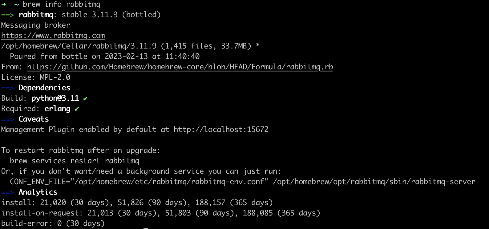
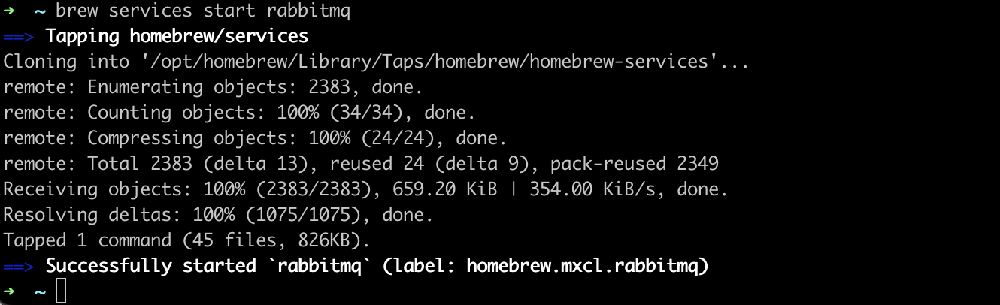
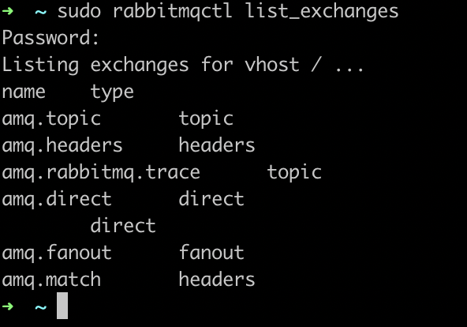
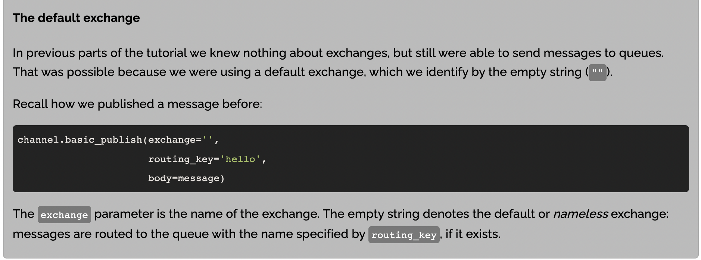
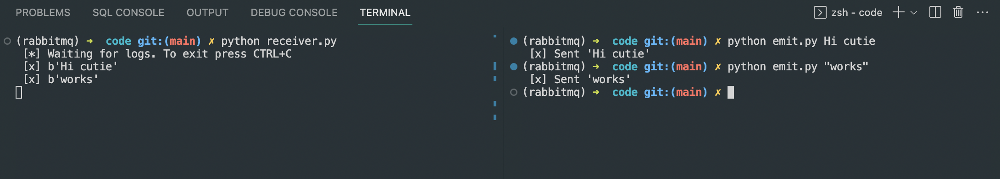

# RabbitMQ🐰


## Basics

Exchange is different from Broker

    Exchange is for routing message received to required message queue by using routing tables

    Exchange is for routing messages to queues

Broker is responsible for delivering messages from one destination to another equired destination.

first it takes msg from publisher and then gives it to exchange which then gives it again tells broker to deliver it further to some destination


Producers/Publisher

Subscribers

## AMQP 0-9-1


AMQP 0-9-1 (Advanced Message Queuing Protocol) is a messaging protocol that enables conforming client applications to communicate with conforming messaging middleware brokers.

Exchanges then distribute message copies to *queues* using rules called  *bindings* .

AMQP 0-9-1 is a programmable protocol in the sense that AMQP 0-9-1 entities and routing schemes are primarily defined by applications themselves, not a broker administrator. Accordingly, provision is made for protocol operations that declare queues and exchanges, define bindings between them, subscribe to [queues](https://www.rabbitmq.com/queues.html) and so on.


## Exchange

*Exchanges* are AMQP 0-9-1 entities where messages are sent to. Exchanges take a message and route it into zero or more queues. The routing algorithm used depends on the *exchange type* and rules called  *bindings* . AMQP 0-9-1 brokers provide four exchange types:

| Exchange type    | Default pre-declared names              |
| ---------------- | --------------------------------------- |
| Direct exchange  | (Empty string) and amq.direct           |
| Fanout exchange  | amq.fanout                              |
| Topic exchange   | amq.topic                               |
| Headers exchange | amq.match (and amq.headers in RabbitMQ) |


Exchanges can be durable or transient. Durable exchanges survive broker restart whereas transient exchanges do not (they have to be redeclared when broker comes back online). Not all scenarios and use cases require exchanges to be durable.

### Default Exchange

Directly delivers msg to the respective queue and has no name of itself.

basically when queue is made a dummy / default exchangeis made for it.

For example, when you declare a queue with the name of "search-indexing-online", the AMQP 0-9-1 broker will bind it to the default exchange using "search-indexing-online" as the routing key (in this context sometimes referred to as the binding key). Therefore, a message published to the default exchange with the routing key "search-indexing-online" will be routed to the queue "search-indexing-online". In other words, the default exchange makes it seem like it is possible to deliver messages directly to queues, even though that is not technically what is happening.

### Direct Exchange

A direct exchange delivers messages to queues based on the message routing key. A direct exchange is ideal for the unicast routing of messages (although they can be used for multicast routing as well). Here is how it works:

* A queue binds to the exchange with a routing key K
* When a new message with routing key R arrives at the direct exchange, the exchange routes it to the queue if K = R

Direct exchanges are often used to distribute tasks between **multiple workers (instances of the same application)** in a round robin manner. When doing so, it is important to understand that, **in AMQP 0-9-1, messages are load balanced between consumers and not between queues.**

    

### Fanout Exchange

A fanout exchange routes messages to **all of the queues that are bound to it** and the routing key is ignored.

Fanout exchanges are ideal for the broadcast routing of messages.

    

### Topic Exchange

Topic exchanges route messages to one or many queues based on matching between a message routing key and the pattern that was used to bind a queue to an exchange

**Topic exchanges have a very broad set of use cases. Whenever a problem involves multiple consumers/applications that selectively choose which type of messages they want to receive, the use of topic exchanges should be considered.**

### Header Exchange

A headers exchange is designed for routing on multiple attributes that are more easily expressed as message headers than a routing key. Headers exchanges ignore the routing key attribute. Instead, the attributes used for routing are taken from the headers attribute. A message is considered matching if the value of the header equals the value specified upon binding.


It is possible to bind a queue to a headers exchange using more than one header for matching. In this case, the broker needs one more piece of information from the application developer, namely, should it consider messages with any of the headers matching, or all of them? This is what the "x-match" binding argument is for. When the "x-match" argument is set to "any", just one matching header value is sufficient. Alternatively, setting "x-match" to "all" mandates that all the values must match.

For "any" and "all", headers beginning with the string **x-** will not be used to evaluate matches. Setting "x-match" to "any-with-x" or "all-with-x" will also use headers beginning with the string **x-** to evaluate matches.

Headers exchanges can be looked upon as "direct exchanges on steroids". Because they route based on header values, they can be used as direct exchanges where the routing key does not have to be a string; it could be an integer or a hash (dictionary) for example.


## Queues

Before a queue can be used it has to be declared. Declaring a queue will cause it to be created if it does not already exist. The declaration will have no effect if the queue does already exist and its attributes are the same as those in the declaration. When the existing queue attributes are not the same as those in the declaration a channel-level exception with code 406 (**PRECONDITION_FAILED**) will be raised.

### Queue Names

Applications may pick queue names or ask the broker to generate a name for them. Queue names may be up to 255 bytes of UTF-8 characters. An AMQP 0-9-1 broker can generate a unique queue name on behalf of an app. To use this feature, pass an empty string as the queue name argument. The generated name will be returned to the client with queue declaration response.

Queue names starting with "amq." are reserved for internal use by the broker. Attempts to declare a queue with a name that violates this rule will result in a channel-level exception with reply code 403 (**ACCESS_REFUSED**).

## Consumers

Storing messages in queues is useless unless applications can *[consume](https://www.rabbitmq.com/consumers.html)* them. In the AMQP 0-9-1 Model, there are two ways for applications to do this:

* Subscribe to have messages delivered to them ("push API"): this is the recommended option
* Polling ("pull API"): this way is **highly inefficient** and **should be avoided** in most cases

With the "push API", applications have to indicate interest in consuming messages from a particular queue. When they do so, we say that they *register a consumer* or, simply put,  *subscribe to a queue* . It is possible to have more than one consumer per queue or to register an *exclusive consumer* (excludes all other consumers from the queue while it is consuming).

Each consumer (subscription) has an identifier called a  *consumer tag* . It can be used to unsubscribe from messages. Consumer tags are just strings.

## AMQP 0-9-1 Methods

AMQP 0-9-1 is structured as a number of  *methods* . Methods are operations (like HTTP methods) and have nothing in common with methods in object-oriented programming languages. Protocol methods in AMQP 0-9-1 are grouped into  *classes* . Classes are just logical groupings of AMQP methods. The [AMQP 0-9-1 reference](https://www.rabbitmq.com/amqp-0-9-1-reference.html) has full details of all the AMQP methods.


Let us take a look at the *exchange* class, a group of methods related to operations on exchanges. It includes the following operations:

* **exchange.declare**
* **exchange.declare-ok**
* **exchange.delete**
* **exchange.delete-ok**

The operations above form logical pairs: **exchange.declare** and **exchange.declare-ok**, **exchange.delete** and **exchange.delete-ok**. **These operations are "requests" (sent by clients) and "responses" (sent by brokers in response to the aforementioned "requests").**

As an example, the client asks the broker to declare a new exchange using the **exchange.declare** method:

    

As shown on the diagram above, **exchange.declare** carries several  *parameters* . They enable the client to specify exchange name, type, durability flag and so on.

If the operation succeeds, the broker responds with the **exchange.declare-ok** method:

    

**exchange.declare-ok** does not carry any parameters except for the channel number


The sequence of events is very similar for another method pair on the AMQP 0-9-1 *queue* method class: **queue.declare** and **queue.declare-ok**:

    

    


#### Not all AMQP 0-9-1 methods have counterparts. Some (**basic.publish** being the most widely used one) do not have corresponding "response" methods and some others (**basic.get**, for example) have more than one possible "response".


## Connections

AMQP 0-9-1 connections are typically long-lived. AMQP 0-9-1 is an application level protocol that uses TCP for reliable delivery. Connections use authentication and can be protected using TLS. When an application no longer needs to be connected to the server, it should gracefully close its AMQP 0-9-1 connection instead of abruptly closing the underlying TCP connection.

Basically close layered connection over tcp not the base tcp when you want to close a pub sub connection.


## Channels


Some applications need multiple connections to the broker. However, it is undesirable to keep many TCP connections open at the same time because doing so consumes system resources and makes it more difficult to configure firewalls. AMQP 0-9-1 connections are multiplexed with *[channels](https://www.rabbitmq.com/channels.html)* that can be thought of as "lightweight connections that share a single TCP connection".

Every protocol operation performed by a client happens on a channel. Communication on a particular channel is completely separate from communication on another channel, therefore every protocol method also carries a channel ID (a.k.a. channel number), an integer that both the broker and clients use to figure out which channel the method is for.

A channel only exists in the context of a connection and never on its own. When a connection is closed, so are all channels on it.

For applications that use multiple threads/processes for processing, it is very common to open a new channel per thread/process and not share channels between them.


# FUN Part 🔥 : lesssggoooooo

### Installation

Follow this [guide](https://www.rabbitmq.com/download.html) for installation as per your system


### MacOS

Verify Installation:



start server: 

```
brew services start rabbitmq
```



similarly for stopping

```
brew services stop rabbitmq
```


On Apple Silicon Macs, [RabbitMQ configuration file](https://www.rabbitmq.com/configure.html#configuration-files) located at **/opt/homebrew/etc/rabbitmq/rabbitmq.conf**. The file does not exist by default and can be created.

#### append path 

`vim .zshrc`

then append `export PATH=$PATH:/opt/homebrew/sbin` to file 


# Publish-Subscribe(using pika python client)

pika module [docs](https://pypi.org/project/pika/)

we're going to build a simple logging system. It will consist of two programs -- the first will emit log messages and the second will receive and print them.

Create a virtual env : 

```bash
conda create -n yourenvname python=x.x
```

then activate it:

`conda activate rabbitmq`

`conda install pip`

`pip install pika`

## Tutorial

The core idea in the messaging model in RabbitMQ is that the producer never sends any messages directly to a queue. Actually, quite often the producer doesn't even know if a message will be delivered to any queue at all

the producer can only send messages to an  *exchange* . An exchange is a very simple thing. On one side it receives messages from producers and on the other side it pushes them to queues. The exchange must know exactly what to do with a message it receives

    


## exchanges

List exchanges present:




# !!! The code snippets are part of a python file so donnot write them on shell, kindly wait and just understand for a while ... 😄!!!


There are a few exchange types available: **direct**, **topic**, **headers** and **fanout**. We'll focus on the last one -- the fanout. Let's create an exchange of that type, and call it **logs**:

```
channel.exchange_declare(exchange='logs',
                         exchange_type='fanout')
```

The above code snippet is used to declare an exchange on a channel.

if we donnot declare a exchange name and pass an empty tring then the default exchange is created, the routing key in default exchange tells what queue to send the message too as it is the name of the queue.




## temp queues

We want to hear about all log messages, not just a subset of them. We're also interested only in currently flowing messages not in the old ones. To solve that we need two things.

Firstly, whenever we connect to Rabbit we need a fresh, empty queue. To do it we could create a queue with a random name, or, even better - let the server choose a random queue name for us. We can do this by supplying empty **queue** parameter to **queue_declare**:

```
result = channel.queue_declare(queue='')
```


At this point **result.method.queue** contains a random queue name. For example it may look like **amq.gen-JzTY20BRgKO-HjmUJj0wLg**.


Secondly, once the consumer connection is closed, the queue should be deleted. There's an **exclusive** flag for that:

```
result = channel.queue_declare(queue='', exclusive=True)
```


## bindings


    

We've already created a fanout exchange and a queue. Now we need to tell the exchange to send messages to our queue. That relationship between exchange and a queue is called a  *binding* .

```
channel.queue_bind(exchange='logs',queue=result.method.queue)
```

## code

after establishing the connection we declared the exchange. This step is necessary as publishing to a non-existing exchange is forbidden.

The messages will be lost if no queue is bound to the exchange yet, but that's okay for us; if no consumer is listening yet we can safely discard the message.


code for publisher:

```
#!/usr/bin/env python
import pika
import sys

connection = pika.BlockingConnection(
    pika.ConnectionParameters(host='localhost'))
channel = connection.channel()

channel.exchange_declare(exchange='logs', exchange_type='fanout')

message = ' '.join(sys.argv[1:]) or "info: Hello World!"
channel.basic_publish(exchange='logs', routing_key='', body=message)
print(" [x] Sent %r" % message)
connection.close()
```


code for subscriber:


```
#!/usr/bin/env python
import pika

connection = pika.BlockingConnection(
    pika.ConnectionParameters(host='localhost'))
channel = connection.channel()

channel.exchange_declare(exchange='logs', exchange_type='fanout')

result = channel.queue_declare(queue='', exclusive=True)
queue_name = result.method.queue

channel.queue_bind(exchange='logs', queue=queue_name)

print(' [*] Waiting for logs. To exit press CTRL+C')

def callback(ch, method, properties, body):
    print(" [x] %r" % body)

channel.basic_consume(
    queue=queue_name, on_message_callback=callback, auto_ack=True)

channel.start_consuming()
```


A callback function is defined to handle incoming messages. In this case, the callback simply prints the received message to the console.

`start_consuming` is called to begin consuming messages from the queue. It enters an infinite loop that listens for incoming messages and invokes the registered callback function for each message received.

in summary: `basic_consume` is used to register a consumer for a queue, while `start_consuming` is used to begin consuming messages from the queue.

it's important to note that you must call `basic_consume` before calling `start_consuming`. `basic_consume` sets up the consumer and tells RabbitMQ which callback function to use when a message is received. `start_consuming` actually starts the message consumption loop.

### Works




h
